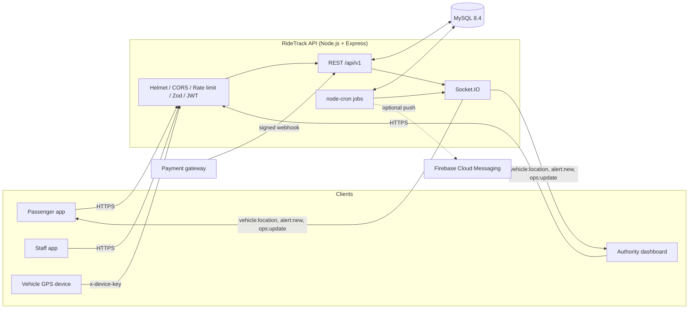
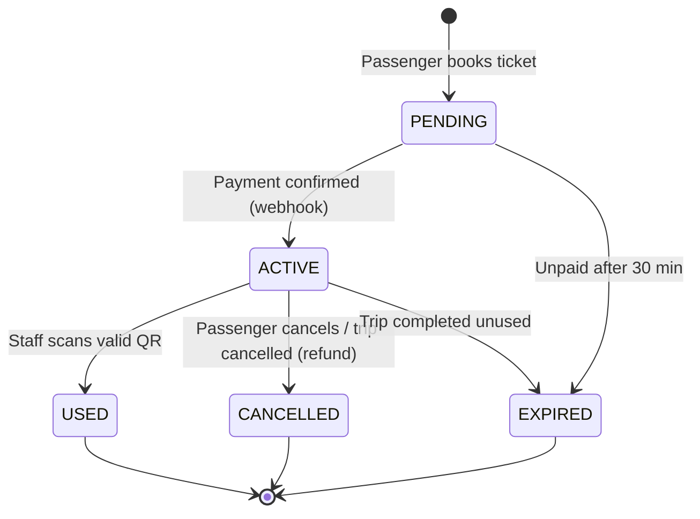
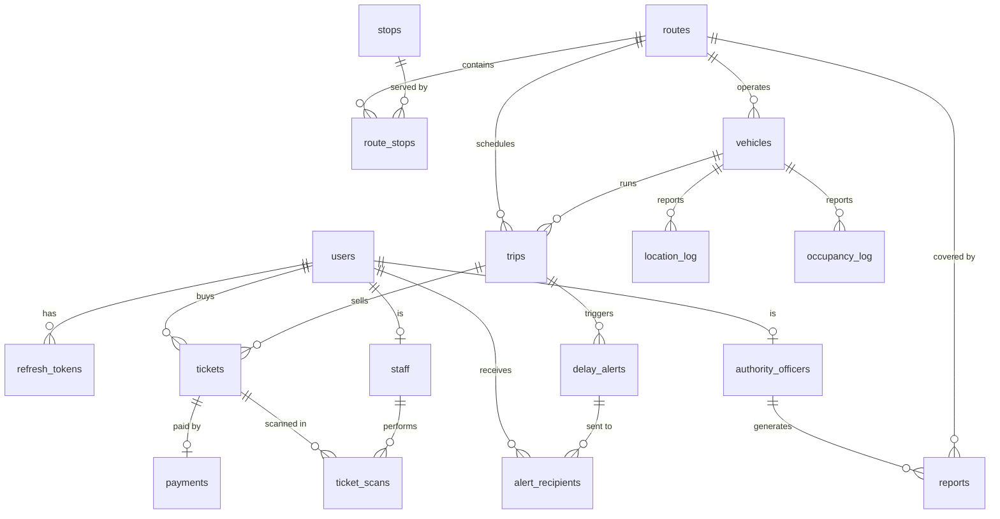

<div align="center">

# 🚍 RideTrack API

**Real-time public transport backend for buses and trains: live tracking, QR ticketing, payments and delay alerts.**


</div>

---

## Overview

RideTrack is the REST + WebSocket backend for a public transport app. It serves three kinds of users:

| Role | What they do |
| --- | --- |
| **Passenger** | Browse routes and stops, see live vehicle positions and ETAs, buy tickets, receive delay alerts |
| **Staff** (conductor / inspector) | Scan and validate QR tickets, report vehicle occupancy |
| **Authority** (operations officer) | Manage routes and trips, monitor the live dashboard, publish alerts, generate reports |

GPS devices on vehicles authenticate separately with a shared device key.

## Features

- 🔐 **JWT auth** with short-lived access tokens, rotating refresh tokens and role-based access control (`PASSENGER`, `STAFF`, `AUTHORITY`)
- 📍 **Live tracking**: GPS ingestion, per-route Socket.IO rooms, live ETA vs. timetable
- 🎫 **QR ticketing**: signed QR payloads, staff validation, manual-ID fallback, cancellation
- 💳 **Payments**: pluggable gateway, HMAC-signed webhooks, mock checkout for development
- ⏱️ **Automatic delay detection**: raises an alert when a trip runs 10+ minutes behind
- 🔔 **Alerts** over WebSocket and optional Firebase push notifications
- 📊 **Ops dashboard and reports** for authority officers
- 🛡️ **Hardened by default**: Helmet, CORS, rate limiting, Zod request validation, constant-time key comparison
- 🧪 **Integration tests** against a real MySQL test database

## Architecture



### Ticket lifecycle



### Data model



## Tech stack

| Layer | Technology |
| --- | --- |
| Runtime | Node.js 20+ (ES modules) |
| Web framework | Express 4, Helmet, CORS, express-rate-limit |
| Real-time | Socket.IO 4 |
| Database | MySQL 8.4 via `mysql2` |
| Validation | Zod |
| Auth | `jsonwebtoken`, `bcryptjs` |
| Scheduling | `node-cron` |
| Testing | Jest, Supertest, socket.io-client |
| Packaging | Docker, Docker Compose |

## Getting started

### Prerequisites

- Node.js 20 or newer
- Docker (for MySQL), or your own MySQL 8 instance

### Quick start

```bash
# 1. Install dependencies
npm install

# 2. Configure the environment
cp .env.example .env

# 3. Start MySQL (exposed on port 3307)
docker compose up -d db

# 4. Create the schema and load demo data
npm run migrate
npm run seed

# 5. Run the API with auto-reload
npm run dev
```

The API is now at `http://localhost:3000`. Check it with `GET /health`.

### Run everything in Docker

```bash
docker compose up -d --build
```

This starts MySQL and the API together. The compose file uses throwaway development secrets; set your own for any real deployment.

### Demo accounts

`npm run seed` creates one user per role. All use the demo password from `scripts/seed.js`.

| Role | Email |
| --- | --- |
| Passenger | `passenger@ridetrack.test` |
| Staff | `staff@ridetrack.test` |
| Authority | `officer@ridetrack.test` |

> Demo data only. Never seed these accounts into a real deployment.

### Simulate live vehicles

```bash
npm run simulate
```

Drives the seeded vehicles along their routes so you can watch live positions, ETAs and delay alerts without real hardware.

## Configuration

Copy `.env.example` to `.env`. Key variables:

| Variable | Purpose |
| --- | --- |
| `PORT`, `PUBLIC_URL` | Listen port and the public URL used to build payment links |
| `CORS_ORIGIN` | `*` or a comma-separated list of allowed origins |
| `DB_HOST`, `DB_PORT`, `DB_USER`, `DB_PASSWORD`, `DB_NAME`, `DB_SSL` | MySQL connection |
| `JWT_ACCESS_SECRET`, `JWT_ACCESS_TTL`, `JWT_REFRESH_TTL_DAYS` | Token signing and lifetimes |
| `QR_SIGNING_SECRET` | Signs ticket QR payloads |
| `PAYMENT_GATEWAY`, `PAYMENT_GATEWAY_KEY` | Gateway selection and webhook signing key (`mock` for development) |
| `DEVICE_API_KEY` | Shared key GPS devices send as `x-device-key` |
| `FCM_SERVICE_ACCOUNT` | Optional Firebase service-account JSON for push notifications |
| `ENABLE_JOBS` | Toggle background jobs |

Use long random values for every secret in production.

## API reference

Base URL: `/api/v1`. Send `Authorization: Bearer <accessToken>` unless noted. Browsing endpoints (routes, stops, arrivals) are public. Roles are enforced server-side.

### Auth and users

| Method | Endpoint | Access | Description |
| --- | --- | --- | --- |
| `POST` | `/auth/register` | Public | Create an account |
| `POST` | `/auth/login` | Public | Obtain access and refresh tokens |
| `POST` | `/auth/refresh` | Public | Rotate the refresh token |
| `GET` | `/users/me` | Any user | Current profile |
| `PATCH` | `/users/me` | Any user | Update profile |
| `PUT` | `/users/me/push-token` | Any user | Register a push token |

### Routes, stops and trips

| Method | Endpoint | Access | Description |
| --- | --- | --- | --- |
| `GET` | `/routes` | Public | List routes |
| `GET` | `/routes/:id` | Public | Route details |
| `GET` | `/routes/:id/arrivals` | Public | Upcoming arrivals |
| `GET` | `/routes/:id/vehicles` | Public | Live vehicles on the route |
| `POST` / `PATCH` | `/routes`, `/routes/:id` | Authority | Create or update routes |
| `POST` | `/routes/:id/stops` | Authority | Add a stop to a route |
| `GET` | `/stops/nearby` | Public | Stops near a coordinate |
| `POST` / `PATCH` | `/trips`, `/trips/:id` | Authority | Schedule or update trips |

### Tickets, payments and scans

| Method | Endpoint | Access | Description |
| --- | --- | --- | --- |
| `POST` | `/tickets` | Passenger | Book a ticket |
| `GET` | `/tickets`, `/tickets/:id` | Passenger | List or view own tickets |
| `POST` | `/tickets/:id/cancel` | Passenger | Cancel a ticket |
| `POST` | `/payments/webhook` | Gateway (`x-signature`) | HMAC-SHA256 signed payment callback |
| `GET` / `POST` | `/payments/mock/*` | Mock gateway only | Development checkout page |
| `POST` | `/scans` | Staff | Validate a ticket QR |
| `GET` | `/trips/:id/scans` | Staff, Authority | Scans for a trip |

### Vehicles, alerts and operations

| Method | Endpoint | Access | Description |
| --- | --- | --- | --- |
| `POST` | `/vehicles/:id/location` | Device key | Submit a GPS position |
| `POST` | `/vehicles/:id/occupancy` | Staff | Report occupancy |
| `GET` | `/alerts` | Passenger, Authority | List alerts |
| `PATCH` | `/alerts/:id/read` | Passenger | Mark an alert read |
| `POST` | `/alerts` | Authority | Publish an alert |
| `GET` | `/ops/dashboard` | Authority | Live operations summary |
| `GET` | `/reports` | Authority | Route, delay and occupancy reports |
| `GET` | `/health` | Public | Liveness and database check |

### Real-time events (Socket.IO)

Connect with a valid access token. Every user joins a private `user:<id>` room; authority users also join `ops`.

| Direction | Event | Payload |
| --- | --- | --- |
| Client → Server | `route:subscribe` / `route:unsubscribe` | `{ routeId }` |
| Server → Client | `vehicle:location` | Live position for a subscribed route |
| Server → Client | `vehicle:occupancy` | Occupancy update for a subscribed route |
| Server → Client | `alert:new` | Personal alert (delay, cancellation, route change) |
| Server → Client | `ops:update` | Change notification for the ops dashboard |

## Background jobs

| Schedule | Job | Purpose |
| --- | --- | --- |
| Every minute | `advanceTrips` | Moves trips `SCHEDULED → ONGOING → COMPLETED` by the clock |
| Every minute | `expireTickets` | Expires unpaid tickets (30 min), refunds and cancels tickets on cancelled trips |
| Every 2 minutes | `detectDelays` | Compares live ETA with the timetable and raises a `DELAY` alert at 10+ minutes late |
| Daily 03:30 | `purgeOldLocations` | Prunes old GPS history |

## Project structure

```text
├── db/schema.sql            # MySQL schema
├── docker/                  # DB init scripts (test database)
├── scripts/                 # migrate, seed, simulate
├── src/
│   ├── app.js               # Express app and route wiring
│   ├── server.js            # HTTP + Socket.IO bootstrap
│   ├── config/              # env and DB pool
│   ├── middleware/          # auth, validation, error handling
│   ├── modules/             # auth, users, routes, vehicles, tickets,
│   │                        # payments, scans, alerts, ops
│   ├── realtime/            # Socket.IO rooms and emitters
│   ├── jobs/                # cron jobs
│   └── utils/               # ETA, geo, errors, async helpers
└── tests/                   # Jest integration and unit tests
```

## Testing

Tests run against a real MySQL test database, created by `docker/init-test-db.sql` when the `db` container first starts.

```bash
docker compose up -d db
npm test
```

## Security notes

- Secrets are read from environment variables; `.env` is git-ignored.
- Payment webhooks are verified with HMAC-SHA256 over the raw request body.
- Device and signature comparisons are constant-time.
- Request bodies are capped at 100 KB and validated with Zod; request logs record paths only, never queries or bodies.
- The mock payment gateway must be explicitly enabled (`ALLOW_MOCK_PAYMENTS=true`) and is for demos only.

## License

Released under the [MIT License](package.json).
